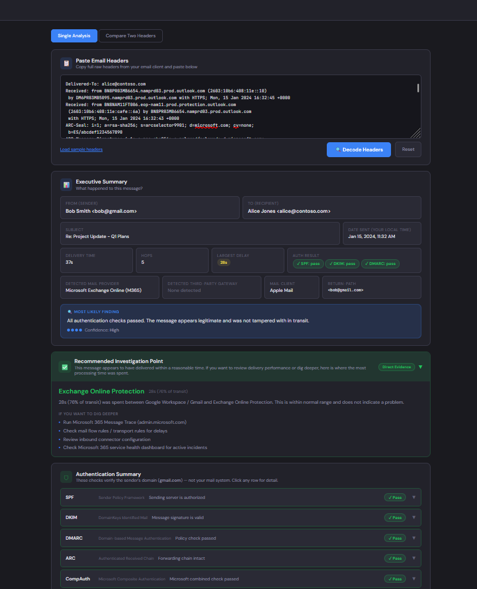

# Mail Flow Analyzer

A single-file forensic mail flow investigation tool. Paste raw email headers and get a structured, plain-English analysis of what happened — where the message went, where time was spent, whether authentication checks out, and where to start if something went wrong.

Built for mail administrators and technically capable users who don't necessarily live in the RFC 5321 spec every day.

#### Demo:
_(host index.html on any static server or open directly in a browser)_

---

#### Screenshot


---

## What it does

This is not a raw header parser. It is a troubleshooting and investigative tool that answers:

1. **What happened?**
2. **Where did it happen?**
3. **What should I investigate next?**

---

## Features

- **Executive Summary** — sender, recipient, subject, local-time date, delivery time, hop count, auth result badges, detected mail provider, detected third-party gateway, and a plain-English "most likely finding"
- **Recommended Investigation Point** — single card identifying where to focus troubleshooting, with suggested checks tailored to the detected system; color-coded and auto-expanded when a real issue is found, collapsed by default when delivery was normal
- **Message Journey Timeline** — hops grouped into logical phases (External Sending, Public Routing, Third-Party Mail Gateway, Internal Hand-off, Cloud Mail Filtering, Internal Routing, Mailbox Delivery, Delivery Outcome); each phase annotated with a plain-English story sentence; each hop card shows system name, delay, TLS status, transit percentage, and full expanded detail
- **Delivery Outcome phase** — always the final entry in the journey; green for successful delivery, red for bounce/reject, amber for deferred or incomplete
- **Authentication Summary** — SPF, DKIM, DMARC, ARC, and Microsoft CompAuth as click-to-expand rows; explanations written in terms of the sender's domain, not generic jargon; softfail vs hard fail explained; sender domain named explicitly throughout
- **Third-party gateway intelligence** — detects Proofpoint, Mimecast, Barracuda, Cisco ESA, Abnormal Security, Sophos, Trend Micro, Symantec/MessageLabs, Forcepoint, and Agari by both hostname pattern and vendor-specific headers; when a gateway is detected, authentication results from the gateway's pre-forwarding check are used as ground truth throughout, with boundary re-check failures explained rather than flagged as spoofing
- **Security Analysis** — sender authorization, TLS coverage, DMARC outcome, DKIM signature status, originating IP, HELO hostname, spam verdict; all written from the receiver's perspective with gateway-aware context
- **Mail provider detection** — identifies Microsoft Exchange Online, Exchange Online Protection, Google Workspace, Amazon SES, on-premises Exchange, and M365 Hybrid; hybrid detection uses cross-tenant headers and hostname fingerprinting
- **Delivery Analysis** — total time, per-hop bar chart, average delay, largest delay with delay category (Normal / Minor / Warning / Critical)
- **Microsoft-specific analysis** — SCL, BCL, PCL with plain-English verdicts; CompAuth reason codes; Network Message ID; Forefront antispam report
- **Evidence classification** — findings tagged as Direct Evidence, Correlated Evidence, or Heuristic Inference
- **Delivery classification** — detects completed delivery, NDR/bounce, SMTP rejection, deferral, and incomplete header sets; analysis language and investigation guidance branch accordingly
- **Additional Headers** — collapsed by default; click to expand; full key/value listing of non-standard headers
- **Raw Headers viewer** — collapsible, searchable with live highlight, copyable
- **Sanitized Sharing** — one-click redaction of email addresses, IPs, Message IDs, tenant identifiers, and internal hostnames for safe use in support tickets or forums
- **Compare Mode** — paste two header sets side by side; see field diffs, auth result diffs, hop-by-hop routing diffs, and Microsoft verdict diffs
- **Dark / Light mode** — defaults to dark; toggle in the top bar

---

## Supported Mail Systems

**Third-party security gateways** (detected by hostname and/or vendor headers):
Proofpoint, Mimecast, Barracuda, Cisco ESA / IronPort, Abnormal Security, Sophos, Trend Micro, Symantec / MessageLabs, Forcepoint, Agari

**Cloud mail platforms:**
Microsoft Exchange Online, Exchange Online Protection, Microsoft Defender for Office 365, Google Workspace / Gmail, Amazon SES, SendGrid, Mailgun

**On-premises and hybrid:**
On-premises Exchange (standalone), On-prem Exchange / M365 Hybrid (cross-tenant header detection)

**MTAs:**
Postfix, Exim, Sendmail

---

## Delivery Scenarios

The tool is designed to handle both completed and failed deliveries:

- **Completed delivery** — full hop-by-hop analysis, delivery outcome confirmation, no-issue state surfaced clearly
- **NDR / bounce** — bounce detection via DSN headers (`Action: failed`, `Final-Recipient`, `Status: 5xx`), failure point identified, investigation guidance provided
- **SMTP rejection** — hard reject detected from sparse hop count and 5xx status codes
- **Deferred delivery** — 4xx temporary failure detected
- **Incomplete headers** — single-hop or truncated header sets handled gracefully with appropriate caveats

> NDR inner-message extraction (parsing the original headers embedded inside a bounce) is stubbed and ready to extend when real-world examples are available.

---

## File Structure

```
mail-flow-analyzer/
├── index.html      # Entire application — no dependencies, no build step
└── README.md
```

That's it. No npm, no build tools, no backend, no accounts.

---

## Setup

Download `index.html` and open it in any modern browser. It runs entirely client-side.

To host it:
- Drop it on GitHub Pages, Netlify, Cloudflare Pages, or any static host
- Or serve it from a local web server for internal team use

No API keys. No configuration. No server required.

---

## Usage

**Single analysis:**
1. Copy the full raw headers from your email client
2. Paste into the text area
3. Click **Decode Headers**

**Compare mode:**
1. Click the **Compare Two Headers** tab
2. Paste one header set into each column
3. Click **Compare Headers**

**Sample headers** are built in — click "Load sample headers" to see a full Proofpoint → Exchange Online example.

---

## How to get raw headers

| Client | Steps |
|---|---|
| Outlook (desktop) | Open message → File → Properties → Internet headers |
| Outlook (web) | Open message → ⋯ menu → View → View message details |
| Gmail | Open message → ⋯ menu → Show original |
| Apple Mail | Open message → View → Message → All Headers (or Cmd+Shift+H) |
| Exchange Admin Center | Message Trace → select message → view header |
| Microsoft 365 Defender | Email & Collaboration → Explorer → select message → Email headers tab |

---

## License

See LICENSE file.
